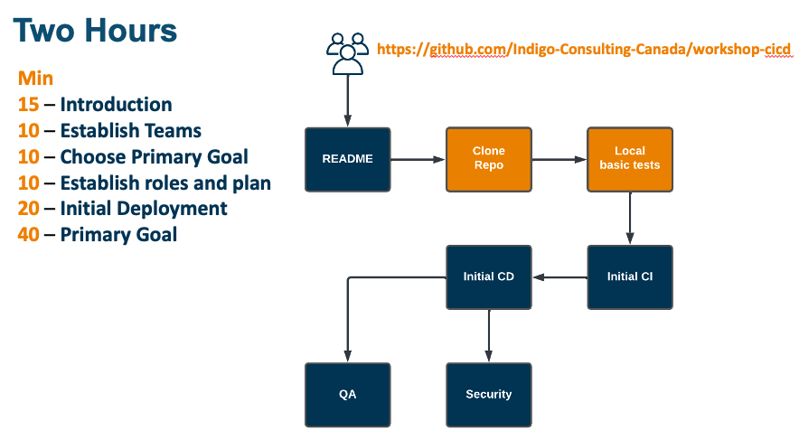
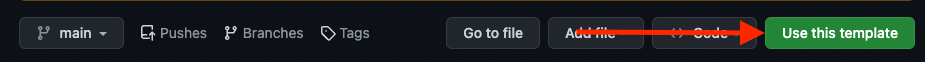
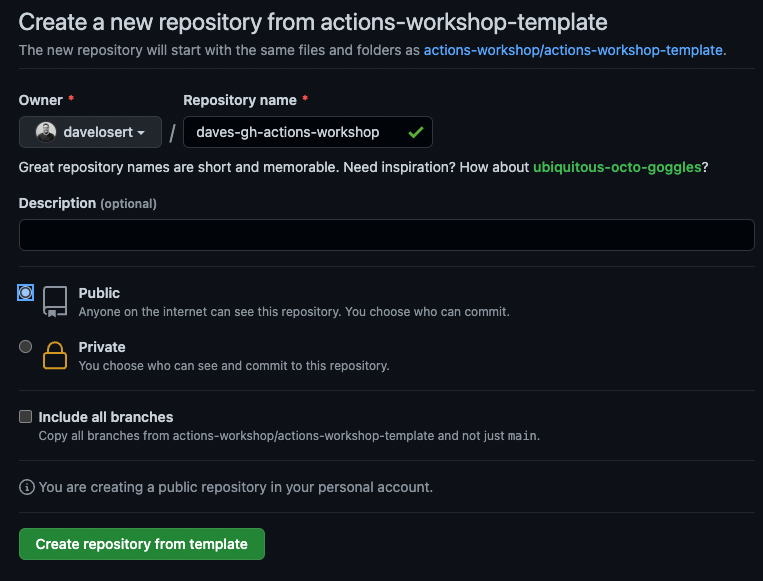

# CI/CD WorkShop 
> Spot issues quickly, save time and be thrifty

## Table of Contents 📑
- [CI/CD WorkShop](#cicd-workshop)
  - [Table of Contents 📑](#table-of-contents-)
  - [Introduction 📝](#introduction-)
  - [Dependencies 📦](#dependencies-)
  - [Getting Started 🚀](#getting-started-)
  - [Running the Application](#running-the-application)
    - [Other useful commands 🛠](#other-useful-commands-)
  - [CI/CD WorkShop](#cicd-workshop-1)
  - [References 📚](#references-)

## Introduction 📝

This workshop is designed to help you understand the importance of CI/CD and how to implement it in your project. We will be using [**GitHub Actions**](https://github.com/features/actions) to automate our CI/CD pipeline. 
In this workshop, we will Test, Build, validate and finally package the application in a Docker container. We will be able to run the packaged application using the docker container. 

We have provided a baseline CI for building and deploying the application, we invite you to choose one primary workshop goal and complete it. If you have time, you can complete the other goals or implement stretch goals as chosen by your team.

Following this workshop, you will create a set of GitHub Action workflows in order to **test, release, secure** and **deploy** the **Rocketdex** 🚀 - an awesome React-Application that lets you view and collect all your favorite rockets!

You will learn how to

- run your [**GitHub Actions**](https://github.com/features/actions)
- use [**the Marketplace**](https://github.com/marketplace)
- create a complete and secure **CI pipeline** from scratch



## Dependencies 📦
- [Docker](https://www.docker.com/)
- [Node.js](https://nodejs.org/en/)
- [npm](https://www.npmjs.com/)
- [git](https://git-scm.com/)
- [GitHub Account](https://github.com)

## Getting Started 🚀

Anything you need for this workshop is contained within this template-repository - so the first thing you need to do is get a copy of it:

1. On the top right, click the green `Use this template` button
    
2. Give your new repository any name you like (for example `<team_name>-cicd-workshop`)
3. Decide for an owner of the new repository.
4. Make it a `Public` repository so you don't use up any of your private action minutes
5. Click `Create repository from template`



## Running the Application 

The **Rocketdex** application is a [React](https://reactjs.org/)-Application build with [vite](https://vitejs.dev/) and tested with [vitest](https://vitest.dev/).

Feel free to explore the files if you're curious about the app's operation (though it's not strictly necessary for understanding the remainder of the workshop).

- [`src/main.tsx`](../src/main.ts) : This is the main entry point of the application.
- [`src/pages/Home.tsx`](../src/pages/Home.tsx) : This route contains most of what you will see upon launching the application.
- [`src/pages/Home.test.ts`](../src/pages/Home.test.tsx) : Here, you will find [`vitest`](https://vitest.dev/) tests that we will run with GitHub Actions.
- [`Dockerfile`](../Dockerfile) : This Docker file packages the application into a container that will be used later in this workshop.

To run the application on your local machine, you will need to install Node.js first.

With a command prompt, you can simply clone it `git clone https://<repository_name>` and install all dependencies using:

```sh
npm install
```

After that, you can start it in development mode to have a look at it:

```sh
npm run dev
```

You can experiment with the below command locally before moving to the Continous Integration and Continous Delivery part of the workshop.

### Other useful commands 🛠

| Description                                               | Command         |
| --------------------------------------------------------- | --------------- |
| Build and Bundle the App using [vite](https://vitejs.dev) | `npm run build` |
| Run Unit Tests with [vitest](https://vitest.dev/)         | `npm run test`  |
| Lint the Code with [ESLint](https://eslint.org/)          | `npm run lint`  |

Optionally, to test the container, run `docker build . -t local:latest` to build the image and `docker run -p 8080:8080 local:latest` to run it. These commands require a local installation of [Docker](https://www.docker.com/).

## CI/CD WorkShop

Now that we have a working application, we can start building our CI/CD pipeline. 

- We will start by creating a very basic pipeline that will build and test our application by following the instructions found [here](./docs/ci.md).
- Now that we are building our application, it is time to deliver. We are will be packaging the application in a Docker Container to easily distribute it by [following these instructions](./docs/cd.md).
- Once we have a working pipeline, we can choose one of the following goals to complete the workshop:
  - **[QA & Test Coverage](./docs/qa.md)**
  - **[Security](./docs/security.md)**
- If you have time, or some team members want to explore Git Hooks, see some of the references below

## References 📚
- [Reference Workshop](https://github.com/actions-workshop/actions-workshopp)
- [ESLint Conventions](https://typescript-eslint.io/rules/naming-convention/)
- [Hashicorp Vault Action](https://github.com/marketplace/actions/hashicorp-vault)
- [Git Hooks Tutorial](https://www.atlassian.com/git/tutorials/git-hooks)
- [Git Hooks & Branch Naming Policy](https://itnext.io/using-git-hooks-to-enforce-branch-naming-policy-ffd81fa01e5e)
- [Git Hooks & Commit Message Policy](https://medium.com/better-programming/stop-adding-bad-commit-messages-to-git-history-7e2f7a5a6c2f)
- [Git Hook PreCommit framework](https://pre-commit.com/)