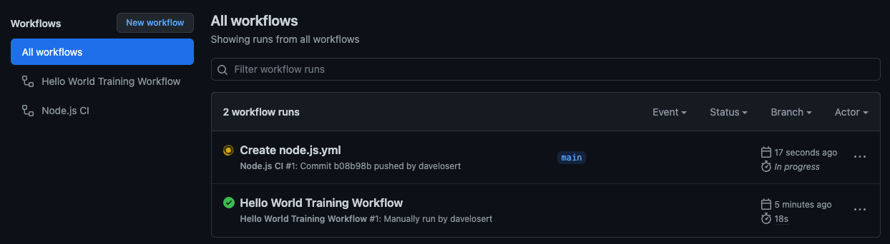
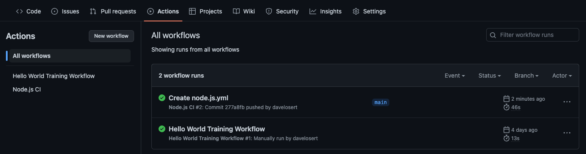

# Implement Continuous Integration (CI)

## Use a starter workflow

To build a workflow that employs Actions for your Continuous Integration process, start by adding a **starter workflow** to your repository:

1. From your repository's main view, find and navigate to the **Actions** tab.
2. Select **New workflow**.
3. Search for `Node.js`.
4. Click **Configure** under the `Node.js` starter workflow.
5. We will remove the [matrix build strategy](https://docs.github.com/en/actions/using-jobs/using-a-matrix-for-your-jobs) as we only want to build for one version of node with a more modern version `20.x`.

<details>
<summary>Your `.github/workflows/node.js.yml` should contain the following:</summary>

```yml
name: Node.js CI

on:
  push:
    branches: [ main ]
  pull_request:
    branches: [ main ]

jobs:
  build:
    runs-on: ubuntu-latest

    steps:
      - uses: actions/checkout@v3
      - name: Use Node.js 20.x
        uses: actions/setup-node@v3
        with:
          node-version: 20.x
          cache: npm
      - run: npm ci
      - run: npm run build --if-present
      - run: npm test
```
</details>

To finish setting up your initial CI workflow, commit the `node.js.yml` file to the `main` branch.

## Understanding references to actions

As you can see, we're now employing a second action in our workflow, `actions/setup-node`, which is used to install a specific Node.js version on the runner.

Let's dissect the reference to that action to understand its structure:

- `actions/` references the owner of the action, which is translated into a user or organization on GitHub.
- `setup-node` refers to the name of the action, which corresponds to a repository on GitHub.
- `@v3` represents the version of the action, which corresponds to a Git tag or a general reference (such as a branch or even a commit SHA) on the repository.

This reference structure makes it straightforward to navigate to the source code of any action by merely appending the `owner` and `name` to the `github.com` URL, like so: `https://github.com/{owner}/{name}`. For the above example, this would be <https://github.com/actions/setup-node>.

## Understanding matrix builds

[matrix build strategy](https://docs.github.com/en/actions/using-jobs/using-a-matrix-for-your-jobs) with two Node.js versions: 16 and 18. A matrix build enables you to execute a job in parallel using various input parameters. In our case, we're running the same job twice, but with distinct Node.js versions.

### Checking workflow runs

Your newly implemented CI workflow now runs with every push. Given that you just pushed a new commit containing the workflow you've created, you should already have a workflow run in progress.



Keep in mind that we will need to run tests as part of our CI workflow. You can find most of this application's tests in the [`src/pages/Home.test.tsx`](../src/pages/Home.test.tsx) file, which partly looks like this:

```typescript
// ... imports

describe("<Home />", (): void => {
  afterEach((): void => {
    cleanup();
  });

  it("renders the octocats returned from the API.", async (): Promise<void> => {
    const inMemoryAPI = createInMemoryOctocatApi();
    inMemoryAPI.addOctocats([
      createTestOctocat({ id: "#1", name: "Octocat 1" }),
      createTestOctocat({ id: "#2", name: "Octocat 2" }),
    ]);

    renderWithProviders({ component: <Home />, inMemoryApi: inMemoryAPI });

    expect(await screen.findByText("Octocat 1")).toBeDefined();
    expect(screen.getByText("Octocat 2")).toBeDefined();
  });

  // ... more tests

});

```

The result of your last push to the main branch should resemble the following:

