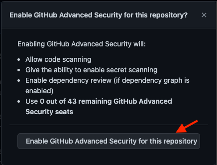
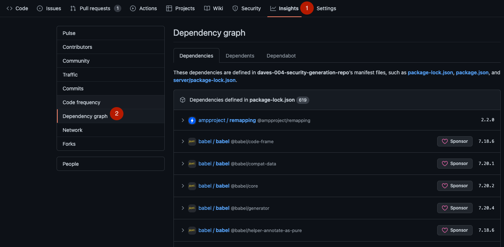
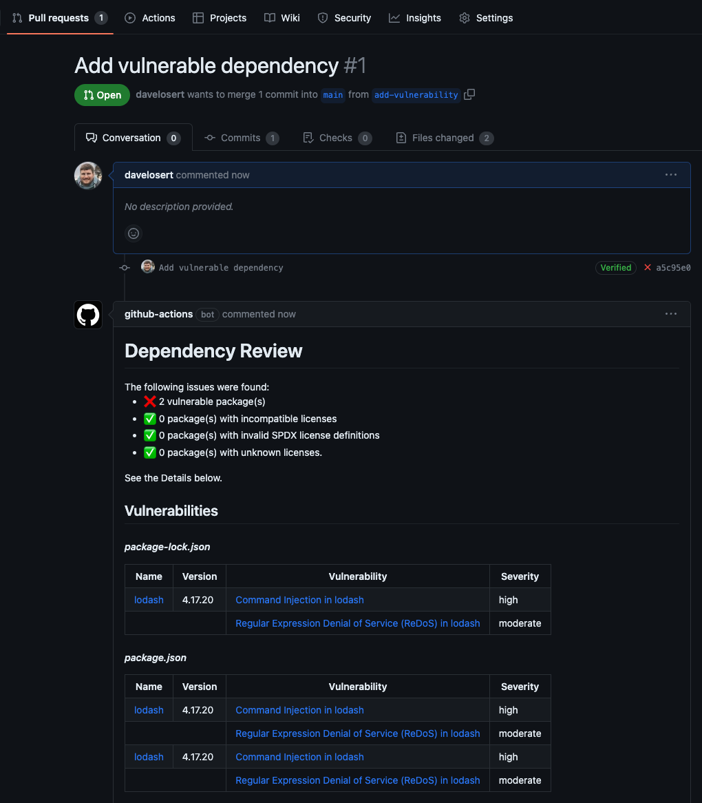
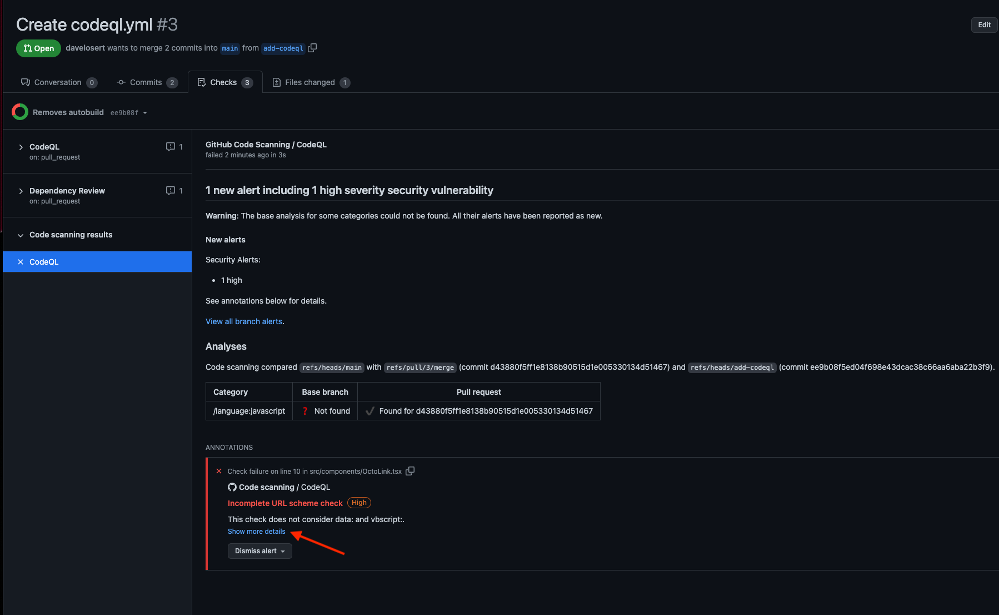
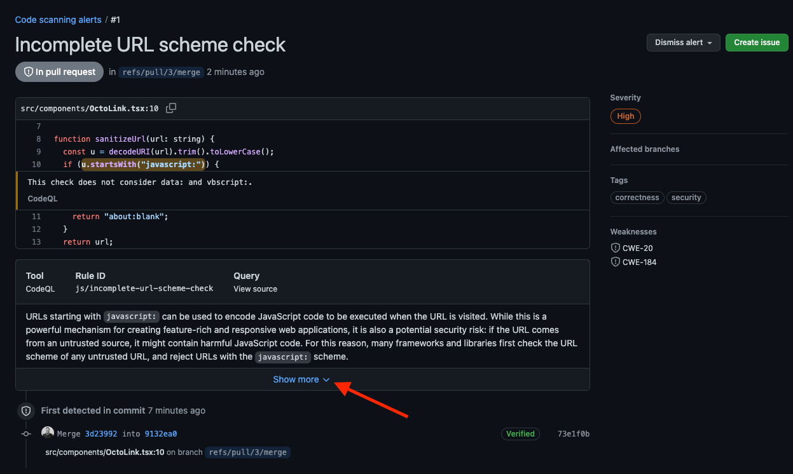
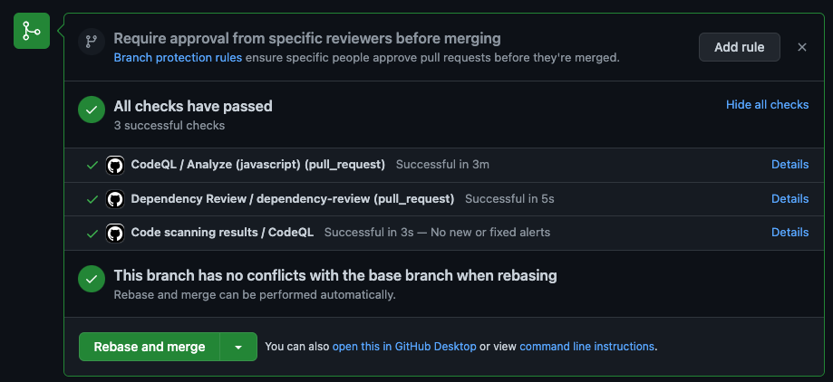

# Security

Security is an integral part of software development. Too much is at stake; it cannot merely be an afterthought in what you do. Instead, it needs to be tightly integrated into your software development lifecycle!

We must spot and fix vulnerabilities as soon as possible, and for this, **automation** plays a significant role. Hence, enter the security stage: GitHub Actions!

You will leverage GitHub Actions to enhance security through automation by creating two new workflows:

1. **Supply-chain security**: You will use the [dependency review action](https://github.com/actions/dependency-review-action) to ensure you're not introducing vulnerable dependencies in your pull requests. This is crucial since, on average, 80% of the code in your project comes from third-party libraries. We need to ensure they are secure before using them!

2. **Code security**: You will perform static code analysis with CodeQL to ensure you're not introducing security vulnerabilities through the code changes you make. After all, even rocket scientists make mistakes!

> **Note**:
> Both of these features are part of GitHub Advanced Security (or GHAS for short), which offers additional security features beyond the actions we are using in this workshop. It's free for public repositories and can thus be used in this workshop. For more details, see [this page](https://docs.github.com/en/code-security/secure-coding/about-github-advanced-security).

## Preparation: Enable dependency graph and GitHub Advanced Security (GHAS)

To activate both features, we first need to prepare our repository by enabling the dependency graph and GitHub Advanced Security:


1. Navigate to your repository's settings.
2. Choose the **Code security and analysis** tab.
3. Click **Enable** for **Dependency graph**.
4. If your repository is not public, click **Enable** for **GitHub Advanced Security** and confirm the activation by clicking **Enable GitHub Advanced Security for this repository** (public repositories have available GHAS features enabled by default).
   

## 1. Add dependency review

By enabling the dependency graph, we've allowed GitHub to analyze the [`package.json`](../package.json) and [`package-lock.json`](../package-lock.json) files in our repository to monitor all dependencies.

You can verify its functionality by going to **Insights** > **Dependency graph** in your repository:



We can use this data with the [dependency review action](https://github.com/actions/dependency-review-action), which cross-references new dependencies and dependency versions against known vulnerabilities in the [GitHub Advisory Database](https://github.com/advisories).

### 1.1 - Add a dependency review workflow

1. Create a new workflow file named `.github/workflows/dependency-review.yml` with the following content:

    ```yml
    name: Dependency Review
    on: pull_request

    permissions:
      contents: read
      pull-requests: write

    jobs:
      dependency-review:
        runs-on: ubuntu-latest
        steps:
          - name: Checkout Repository
            uses: actions/checkout@v3
          - name: Dependency Review
            uses: actions/dependency-review-action@v3
            with:
              comment-summary-in-pr: true
    ```

2. Commit this file to your `main` branch.

### 1.2 - Make sure it works

Let's test if this workflow functions correctly. To do so, we will install a new dependency. Follow the steps below in a repository cloned on your local machine or from within a GitHub Codespace:

1. Open a terminal.

2. Create a new branch named `add-vulnerability`.

    ```bash
    git checkout -b add-vulnerability
    ```

3. Install `lodash` version `4.17.20`, which is known to be vulnerable:

    ```bash
    npm install lodash@4.17.20
    ```

4. This will modify both the `package.json` and the `package-lock.json` files. Commit these changes and push the branch to GitHub:

    ```bash
    git add package.json package-lock.json
    git commit -m "Add vulnerable dependency"
    git push -u origin add-vulnerability
    ```

5. Open a pull request for your branch. If you're unfamiliar with how to open a pull request, refer to our [documentation on creating a pull request](https://docs.github.com/en/pull-requests/collaborating-with-pull-requests/proposing-changes-to-your-work-with-pull-requests/creating-a-pull-request?tool=cli).

6. By opening a pull request, you will trigger the `Dependency Review` workflow. However, it will fail due to the newly introduced vulnerability. Since we set the `comment-summary-in-pr` option to `true`, a comment containing a summary of the found vulnerabilities
will be automatically added to the pull request.
    

    Alternatively, you can also view the summary in the workflow run's dashboard. Click on the **Details** link next to the failed check, and then navigate to the workflow's **Summary**:

    

    

Inspect the links in the summary. They will direct you to the advisory on GitHub, where you can find more details about the vulnerability and recommendations for remediation.

> **Note**:
You have the option to fix the vulnerability by upgrading to the patched version of `lodash`. This step is not mandatory to proceed with the workshop, so you can keep the pull request as a reference if you prefer.

The Dependency Review workflow summary might also touch on licenses, for instance, if you're introducing a dependency with a prohibited license based on the configuration of the dependency review action. You can learn more by reading the [dependency review action README](https://github.com/actions/dependency-review-action).

## 2. Add code scanning with CodeQL

Now, let's integrate another security feature into our repository: CodeQL, GitHub's static code analysis (SCA) tool.

CodeQL operates by first building a database from your code and then running a set of predefined queries against this database. Each query detects a specific type of vulnerability. These queries are written in a custom language called QL and are stored in the official [CodeQL repository](https://github.com/github/codeql). Thus, when new queries are developed and added to this repository, they automatically become available for you to use.

Actions speak louder than words (pun intended), so let's set up a workflow that performs code scanning with CodeQL.

### 2.1 - Add a CodeQL workflow

In your repository, navigate to **Actions**, then click **New workflow**. Scroll down to the **Security** section, find the **CodeQL Analysis** workflow, and click on **Configure**:


Examine the `.github/workflows/codeql.yml` file that is set to be created. Before committing it, let's understand and possibly modify some of its components.

1. The `on:` section defines several triggers. You're already familiar with the `push` and `pull_request` triggers from earlier workflows. The `schedule` trigger, however, might be new to you:

    ```yml
    on:
      push:
        branches: [ main ]
      pull_request:
        branches: [ main ]
      schedule:
        - cron: '23 18 * * 1'
    ```

    As the name suggests, this trigger will initiate the workflow on a schedule, meaning it will execute at specified times or intervals. The `cron` expression defines this schedule in a format that's easy to understand. In this configuration, it's set to run every Monday at 6:23 PM. To gain a deeper understanding of the syntax, refer to the [GitHub Docs](https://docs.github.com/en/actions/using-workflows/events-that-trigger-workflows#schedule).

    Running a code scan once a week is advisable since new queries might have been added to the CodeQL repositories, potentially revealing vulnerabilities that were previously undetected in your code.

2. The `strategy` section introduces another `matrix`, a concept you're already familiar with:

     ```yml
    strategy:
      fail-fast: false
      matrix:
        language: [ 'javascript' ]
    ```

    But what about `fail-fast`? By default, if any job in a job matrix fails, the remaining jobs are halted immediately to save on Actions minutes. By setting `fail-fast` to `false`, we override this default behavior. This ensures all jobs in the job matrix complete their execution, regardless of the outcome of individual jobs.

    This configuration is especially useful for projects that use multiple languages. While it isn't the case here, it doesn't harm to retain this setup.

3. The steps section includes the `Initialize CodeQL` step. This step downloads the CodeQL CLI and initializes the CodeQL database by populating it with the code from our repository.

    ```yml
    - name: Initialize CodeQL
      uses: github/codeql-action/init@v2
      with:
        languages: ${{ matrix.language }}
    ```

4. The `Autobuild` step is specifically beneficial for compiled languages like Java, C++, and Go. For such languages, CodeQL observes how the application is compiled to yield more accurate scan results. However, given that our application is built with JavaScript/Typescript, this step is unnecessary, so you can safely omit it in your workflow.

    ```yml
    - name: Autobuild
      uses: github/codeql-action/autobuild@v2
    ```

5. The `Perform CodeQL Analysis` step runs the CodeQL queries against the database containing your code. Once completed, it uploads the results to GitHub, enabling you to examine them.

    ```yml
    - name: Perform CodeQL Analysis
      uses: github/codeql-action/analyze@v2
      with:
        category: "/language:${{matrix.language}}"
    ```

6. Save these changes and commit this file to a new branch named `add-codeql`. Following this, open a pull request targeting the `main` branch.

<details>
<summary>The final version of the workflow file should look like this:</summary>

```yml
name: "CodeQL"

on:
  push:
    branches: [ main ]
  pull_request:
    branches: [ main ]

jobs:
  analyze:
    name: Analyze
    runs-on: ubuntu-latest
    permissions:
      actions: read
      contents: read
      security-events: write

    strategy:
      fail-fast: false
      matrix:
        language: [ 'javascript' ]

    steps:
      - name: Checkout repository
        uses: actions/checkout@v3

      - name: Initialize CodeQL
        uses: github/codeql-action/init@v2
        with:
          languages: ${{ matrix.language }}

      - name: Perform CodeQL Analysis
        uses: github/codeql-action/analyze@v2
        with:
          category: "/language:${{matrix.language}}"
```

</details>

By committing and opening the pull request, the CodeQL workflow will be automatically triggered. It will run for a while, so you can go into the workflow run logs and observe what it's doing.

### 2.2 Add a vulnerability

Luckily, you don't seem to have any vulnerabilities in your code. 😮‍💨

Let's introduce one to see how CodeQL operates and alerts us within a pull request, enabling us to address it before it gets merged into the `main` branch.

Conduct the following actions in a repository cloned on your local machine or from within a GitHub Codespace:

1. Open a terminal and checkout the `add-codeql` branch we just created:

    ```bash
    git fetch --all
    git checkout add-codeql
    ```

2. Navigate to the file [`src/components/OctoLink.tsx`](../src/components/OctoLink.tsx) and look at the function `sanitizeUrl` on line 10:

    ```tsx
    function sanitizeUrl(url: string) {
      // UNCOMMENT THE FOLLOWING LINES TO INTRODUCE A SECURITY VULNERABILITY FOR STEP 04: SECURITY
      // const u = decodeURI(url).trim().toLowerCase();
      // if (u.startsWith("javascript:")) {
      //   return "about:blank";
      // }
      return url;
    }
    ```

3. There is some commented-out code which is, in fact, insecure. Go ahead and remove the comments (remove the `//` characters at the beginning of each line):

    ```tsx
    function sanitizeUrl(url: string) {
      // UNCOMMENT THE FOLLOWING LINES TO INTRODUCE A SECURITY VULNERABILITY FOR STEP 04: SECURITY
      const u = decodeURI(url).trim().toLowerCase();
      if (u.startsWith("javascript:")) {
        return "about:blank";
      }
      return url;
    }
    ```

4. Commit your changes back to the branch by typing the following commands into your terminal:

   ```bash
   git add .
   git commit -m "Add security vulnerability"
   git push
   ```

This will trigger the CodeQL workflow in your pull request again.

### 2.3 - Check the code scanning results

After the CodeQL workflow has finished, navigate to the pull request and inspect the results.

1. As expected, it now found the vulnerability we just introduced. Let's quickly click on **Details** to find out more.

    

2. This will bring us to the **Checks** tab of the pull request, informing us that we have an incomplete URL schema check vulnerability with high severity. Click on **Details** again to learn more.

    

3. This directs us to the **Code scanning** tab under the repository's **Security** tab. Here, we find all the details of the vulnerability we've discovered: its location in the code, a description of the issue, and even guidance on how to fix it (after clicking on **Show more**).

    

4. Okay, so it's time to fix this! You should have all the information you need to address the issue on your own. However, if you need a hint, you can click on the button below to reveal the solution.

   <details>
   <summary>
   How to fix the vulnerability
   </summary>

   Modify line 10 in the file [`src/components/OctoLink.tsx`](../src/components/OctoLink.tsx#10) to the following, then commit and push your changes:

   ```tsx
    if (u.startsWith("javascript:") || u.startsWith("data:") || u.startsWith("vbscript:")) {
      return "about:blank";
    }
   ```

   </details>

  After you've made the changes and the CodeQL workflow runs again, the vulnerability will be resolved, and all checks on the pull request should pass.

   

## (Optional) 3. Require both workflows to succeed before being able to merge a pull request

Similar to [step 3.6 of lab 2](002-basics-of-ci-with-actions.md#34-optional---enforce-a-certain-coverage-threshold-with-branch-protection-rules), you can enforce that both workflows need to succeed before being allowed to merge a pull request. This is achieved by adding them to the required status checks of your branch protection rule for the `main` branch.

This ensures that no one can introduce any new vulnerabilities to your `main` branch.

## Conclusion

And that's it! By working with GitHub Advanced Security and Actions, we identified vulnerabilities both in our code as well as in our dependencies, and were able to promptly remediate them, well before they could pose an actual threat.

In this lab, you learned how to:

- 👏 Activate the dependency graph and GitHub Advanced Security in your project
- 👏 Use the dependency review action to scan your dependencies for vulnerabilities
- 👏 Use the CodeQL action to scan your code for vulnerabilities

> **Note**
> What you learned in this lab is just the beginning of how GitHub Advanced Security can assist you in making your code secure. To delve deeper, feel free to read through the [Addendum - GitHub Advanced Security](./addendum-004-github-advanced-security.md)!